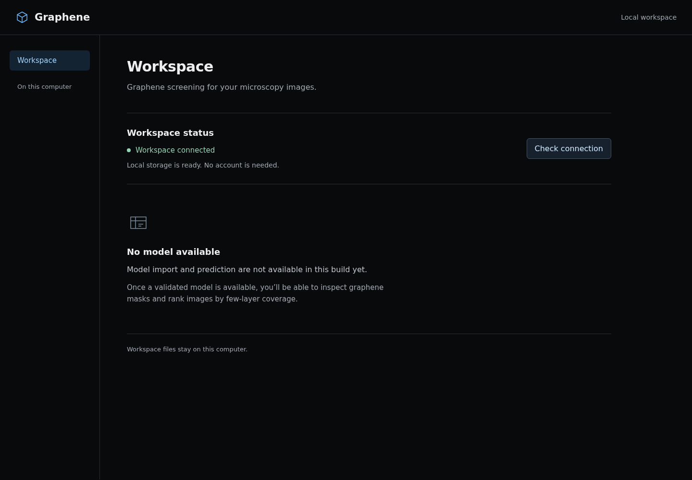
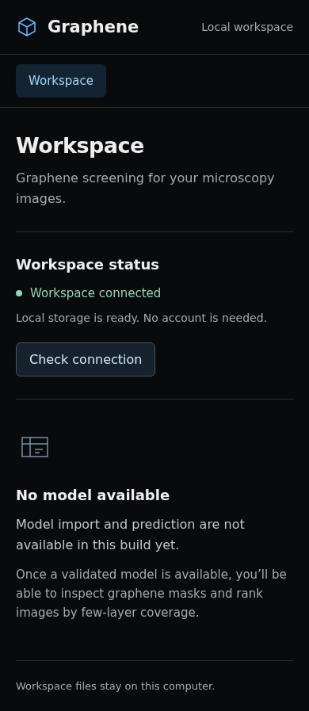
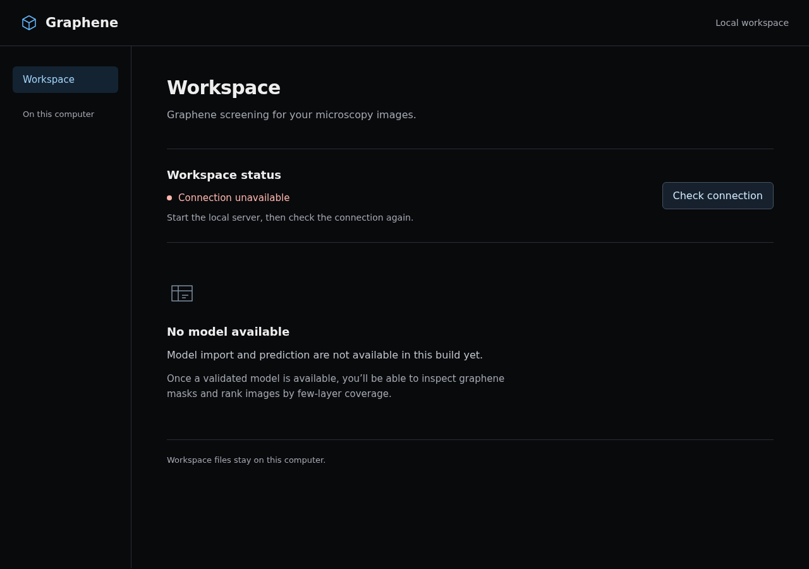

# WI-01 verification evidence

Status: implemented and technically verified; stakeholder review/PR merge pending.
Source Issue: [#1](https://github.com/camiloandcu/Graphene-Segmentation/issues/1).
Branch: `feat/wi-01-local-workspace`. No main merge/update or remote data migration.

## Acceptance

| Criterion | State | Evidence |
| --- | --- | --- |
| AC-1: documented setup starts without accounts/cloud | Passed | Python 3.12.13 locked production-only installation; real loopback launcher, health and built frontend with outbound connections blocked and Supabase/JWT unset. Frontend clean install/build succeeded. Real process tests also cover restart and existing dummy credentials. |
| AC-2: metadata/artifact persistence and recovery | Passed | Internal opaque fixture bytes/metadata survive process exit, restart and restored-directory relocation. Publication/commit failures, process termination at staging/publication/commit, checksum corruption/missing/symlink/FIFO artifacts, path confinement, schema rejection and second-writer rejection covered by integration checks. |
| AC-3: loopback, no cloud startup or secret logging | Passed | Default launcher observed on 127.0.0.1:8000. Fresh interpreter blocks external/ML imports and connections; production-only environment has 12 runtime packages, no Supabase/JWT/Torch/TensorFlow/MLflow. Dummy credentials absent from captured logs. Explicit local CORS verified. |

These are foundation checks using opaque fixtures, not a trained model or inference
validation. Lab model accuracy, GPU performance and 40+ batch behavior remain
unverified and belong to later Work Items.

## Executed checks

- `backend/.venv/bin/python -m pytest`: **24 passed** (Python 3.12.13, pytest 8.3.5).
- `uv sync --locked --no-dev --python 3.12`: passed, followed by production-only
  offline loopback launcher smoke. Development dependencies restored afterward.
- `npm ci --registry=https://registry.npmjs.org --ignore-scripts --no-audit --no-fund`:
  clean installation passed (142 packages; Node 24.18.0 / npm 12.1.0).
- `npm run build`: TypeScript check and Vite build passed; 28 modules; JS 146.69 kB
  (47.41 kB gzip), CSS 3.35 kB. Initial legacy build also passed but used 711 modules
  and JS 721.17 kB. A stale Browserslist warning remains non-blocking.
- Playwright/installed Chromium: 1440×1000 desktop and 390×844 mobile; no horizontal
  overflow, no page errors, empty-model state, connection failure/retry, malformed
  health response and keyboard skip-link verified.
- Impeccable detector on `frontend/src/App.tsx`: no findings. Rendered screenshots
  inspected directly; no broad interface redesign was attempted.

An initial npm metadata command failed because the environment's configured
registry differed from lockfile tarball hosts under npm 12. The clean install
above uses the matching registry without weakening remote-dependency policy.

## Browser evidence and reproduction







Start the launcher, then optionally use isolated browser tooling:

```bash
uv run --no-project --python 3.12 --with playwright playwright install chromium
uv run --no-project --python 3.12 --with playwright python scripts/check-local-ui.py
```

An existing Chromium can be supplied with `--browser-executable /path/to/chrome`.
Screenshots default to `/tmp/graphene-wi01-review`. Browser tooling is not part of
production dependencies. The committed captures contain only fixture/empty state.

## Completion boundary

Implementation approval was given in the conversation before coding. Project-only
GitHub workflow is recorded in `AGENTS.md`; no global guide edit was applied.
All 14 executable candidates have Issues; WI-01 alone has an OpenSpec change.
Specification sync/archive and PR traceability are engineering handoff steps;
Issue closure, stakeholder acceptance, merge and release remain separate states.
